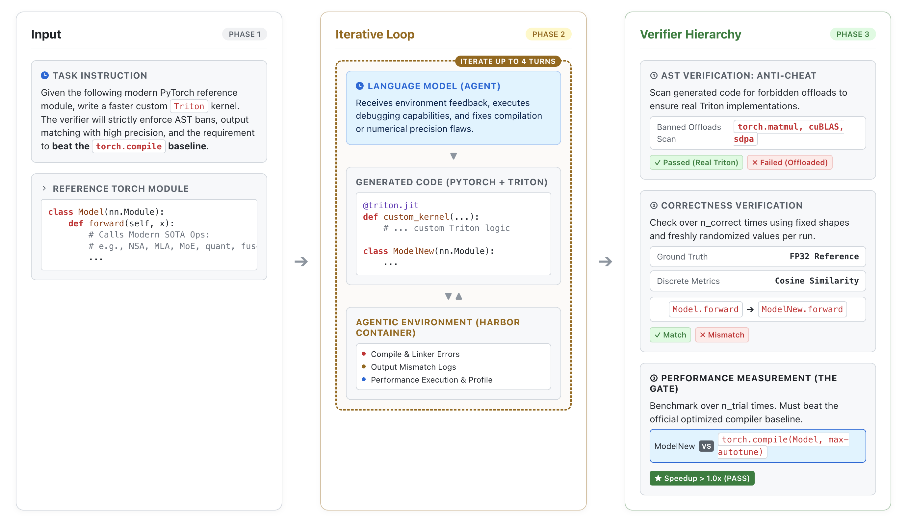

# KernelBench-Harbor

An agentic GPU-kernel performance benchmark — a redesign of
[KernelBench](https://github.com/ScalingIntelligence/KernelBench) in the Harbor format. The model
is given a naive PyTorch reference module and must write a Triton replacement that is numerically
correct and faster than `torch.compile(max-autotune)`, iterating in a real container with
compiler/profiler feedback.

Design thesis: difficulty should come from the operator, not from the grading setup. Every family
ships a pass-validated oracle (a known-good Triton solution) proving the task is solvable.

## What's different from KernelBench

| | KernelBench | KernelBench-Harbor |
|---|---|---|
| Interaction | single-shot | agentic (Harbor, terminus-2, ≤4 turns) |
| Task | PyTorch → CUDA/Triton | PyTorch → Triton, from scratch |
| Baseline to beat | PyTorch eager | `torch.compile(max-autotune)` |
| Axis | mostly correctness | performance (correct-but-slow fails) |
| Operators | classic | modern LLM serving/training kernels |
| Anti-reward-hack | — | AST: no matmul/softmax/sdpa/cuBLAS offload |

## Architecture

Input → agentic refinement loop → 3-stage verifier:



- Phase 1 — Input: a naive PyTorch `Model` (+ `get_inputs` with real HF shapes) and the
  instruction to write `ModelNew` with a real `@triton.jit` kernel.
- Phase 2 — Agentic refinement (≤4 turns): the model iterates in a Harbor sandbox on Modal L40S,
  using compile errors, output-mismatch logs, and performance profiles.
- Phase 3 — Verifier: ① AST anti-cheat → ② correctness vs fp32 ground truth → ③ performance gate
  (beat `torch.compile(max-autotune)`).

## Results

3 frontier models, agentic, Modal L40S, 2 samples/task. pass@1 = single-sample pass rate;
pass@2 = either of the 2 samples passes. Per-family matrix and reproduce script in
[results/](results/RESULTS.md).

| Model | pass@1 | pass@2 |
|---|:--:|:--:|
| GPT-5.5 | 40% (8/20) | 50% (5/10) |
| Opus-4.8 | 25% (5/20) | 40% (4/10) |
| Gemini-3.5-flash | 5% (1/20) | 10% (1/10) |

GPT and Opus sit in the trial's 10–60% band, with a clean gradient and no family solved by all
three. Three families are unsolved by any model (the hard tail) yet all 10 have a passing oracle.

### Per-family pass@2

| Family (real config) | GPT-5.5 | Opus-4.8 | Gemini-3.5-flash |
|---|:--:|:--:|:--:|
| fp8_microscale (Llama-3-8B down) | ✅ | ✗ | ✅ |
| moe_top2 (Mixtral-8x7B) | ✅ | ✅ | ✗ |
| ssm_scan (Mamba-130M) | ✅ | ✅ | ✗ |
| mla_decode (DeepSeek-V2) | ✗ | ✅ | ✗ |
| w8a8_smoothquant (Llama-3-8B down) | ✅ | ✗ | ✗ |
| fused_silu_fp8 (Mixtral) | ✗ | ✅ | ✗ |
| nsa_block_sparse (DeepSeek NSA) | ✅ | ✗ | ✗ |
| quant_w4a16_pa (Llama-3-8B down) | ✗ | ✗ | ✗ |
| fused_qmoe (Mixtral) | ✗ | ✗ | ✗ |
| multi_lora_qgemm (Llama-3-8B) | ✗ | ✗ | ✗ |

We also noticed a single-vs-agentic gap that motivated the agentic design: models often fail a
kernel on the first try but fix it over a few turns. For example, GPT-5.5 goes from ≈25% single-shot
to 40% agentic pass@1 — e.g. it fails NSA single-shot, then iterates to a passing 1.18× kernel.

## The 10 families

`quant_w4a16_pa` · `fp8_microscale` · `moe` (top-2/6/8) · `ssm_scan` · `mla_decode` ·
`w8a8_smoothquant` · `fused_silu_fp8` · `fused_qmoe` · `multi_lora_qgemm` · `nsa_block_sparse`

132 tasks = families × parameter grids over real HuggingFace configs (layer dims, group sizes,
#experts, dtypes). Difficulty is authored once per family; volume comes from the grids.

## Repository layout

```
tasks/<family>/<task>/        132 Harbor tasks, grouped by family
subset_final/                 the 10-task measured subset (1 per family)
common/
  kb_verifier.py              shared grader: AST anti-cheat + correctness + speedup
  oracles/<family>.py         10 pass-validated known-good Triton solutions
generate_tasks.py             task generator (template x grid -> Harbor dirs, embeds oracle)
validate/                     Modal scripts: difficulty probe + oracle check
results/
  RESULTS.md                  results + insights
  compute_passk.py            reproduce the pass@1/@2 table from the logs
  jobs/<Model>/sample{1,2}/   Harbor agentic trajectories (run evidence)
docs/SCALING.md               scaling pipeline 10s -> 100K
presentation/                 slides + architecture diagram
```

## How to run

```bash
# generate / regenerate all tasks
uv run python generate_tasks.py

# agentic eval of the 10-task subset with one model (Harbor on Modal)
export OPENROUTER_API_KEY=...    # also need a Modal account
harbor run -p subset_final -e modal -a terminus-2 \
  -m openrouter/openai/gpt-5.5 --ak max_turns=4 \
  --ae 'OPENROUTER_API_KEY=${OPENROUTER_API_KEY}' -o jobs_run

# sanity-check a family's oracle passes the verifier
uv run modal run validate/check_oracle.py --fam fused_qmoe
```

## Verifier

`common/kb_verifier.py` grades each submission:

1. AST anti-cheat — requires a real `@triton.jit` kernel; rejects offloading core compute to
   `torch.matmul/softmax/einsum`, `F.linear`, `sdpa`, `flash_attn`, cuBLAS/cuDNN. AST-based, so a
   banned op mentioned in a comment does not false-reject.
2. Correctness — vs fp32 ground truth over several random draws. Families whose output is itself
   quantized or top-k-selected (`fused_silu_fp8`, `nsa_block_sparse`) use a cosine/relative metric
   (standard for such kernels); the rest use `allclose`.
3. Performance — median runtime vs `torch.compile(max-autotune)` (eager also reported);
   correct-but-slow does not pass.

## Scaling

See [docs/SCALING.md](docs/SCALING.md): a confirmed-hard template scales to hundreds of tasks via
parameter grids with no new design; the verifier is written once and shared; difficulty at scale
is estimated by sampling. Cost and staffing for 1K / 10K / 100K are included.
